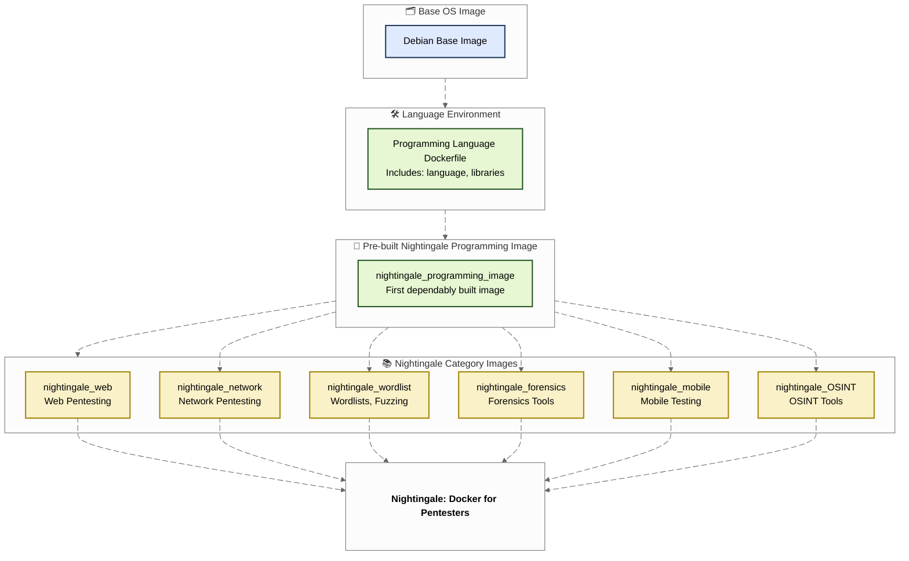

## Nightingale Architecture diagram

```mermaid
---
config:
  theme: neutral
  look: classic
  layout: dagre
---
flowchart TD
 subgraph BASE["🗂️ Base OS Image"]
        A["Debian Base Image"]
  end
 subgraph LANG["🛠️ Language Environment"]
        B["Programming Language Dockerfile<br>Includes: language, libraries"]
  end
 subgraph PREP["🔶 Pre-built Nightingale Programming Image"]
        C["nightingale_programming_image<br>First dependably built image"]
  end
 subgraph CAT["📚 Nightingale Category Images"]
    direction TB
        D1["nightingale_web<br>Web Pentesting"]
        D2["nightingale_network<br>Network Pentesting"]
        D3["nightingale_wordlist<br>Wordlists, Fuzzing"]
        D4["nightingale_forensics<br>Forensics Tools"]
        D5["nightingale_mobile<br>Mobile Testing"]
        D6["nightingale_OSINT<br>OSINT Tools"]
  end
 subgraph FINAL["<br>"]
        E@{ label: "**<span style=\"background-color:\">Nightingale: Docker for Pentesters**</span>" }
  end
    BASE L_BASE_LANG_0@--> LANG
    LANG L_LANG_PREP_0@--> PREP
    PREP L_PREP_CAT_0@--> CAT & D2 & D3 & D4 & D5 & D6
    D1 L_D1_FINAL_0@--> FINAL
    D2 L_D2_FINAL_0@--> FINAL
    D3 L_D3_FINAL_0@--> FINAL
    D4 L_D4_FINAL_0@--> FINAL
    D5 L_D5_FINAL_0@--> FINAL
    D6 L_D6_FINAL_0@--> FINAL
    C@{ shape: rect}
    D1@{ shape: rect}
    D2@{ shape: rect}
    D3@{ shape: rect}
    D4@{ shape: rect}
    D5@{ shape: rect}
    D6@{ shape: rect}
    E@{ shape: rect}
     A:::base
     B:::stage
     C:::stage
     D1:::cat
     D2:::cat
     D3:::cat
     D4:::cat
     D5:::cat
     D6:::cat
     E:::final
    classDef base fill:#e0eaff,stroke:#1e3a5c,stroke-width:2px
    classDef stage fill:#e7f7d3,stroke:#255723,stroke-width:2px
    classDef cat fill:#faf1c8,stroke:#a48608,stroke-width:2px
    classDef final fill:#ffe5e5,stroke:#ae231c,stroke-width:4px,font-weight:bold
    style E fill:transparent,stroke:none
    L_BASE_LANG_0@{ animation: fast } 
    L_LANG_PREP_0@{ animation: fast } 
    L_PREP_CAT_0@{ animation: fast } 
    L_PREP_D2_0@{ animation: fast } 
    L_PREP_D3_0@{ animation: fast } 
    L_PREP_D4_0@{ animation: fast } 
    L_PREP_D5_0@{ animation: fast } 
    L_PREP_D6_0@{ animation: fast } 
    L_D1_FINAL_0@{ animation: fast } 
    L_D2_FINAL_0@{ animation: fast } 
    L_D3_FINAL_0@{ animation: fast } 
    L_D4_FINAL_0@{ animation: fast } 
    L_D5_FINAL_0@{ animation: fast } 
    L_D6_FINAL_0@{ animation: fast }
```